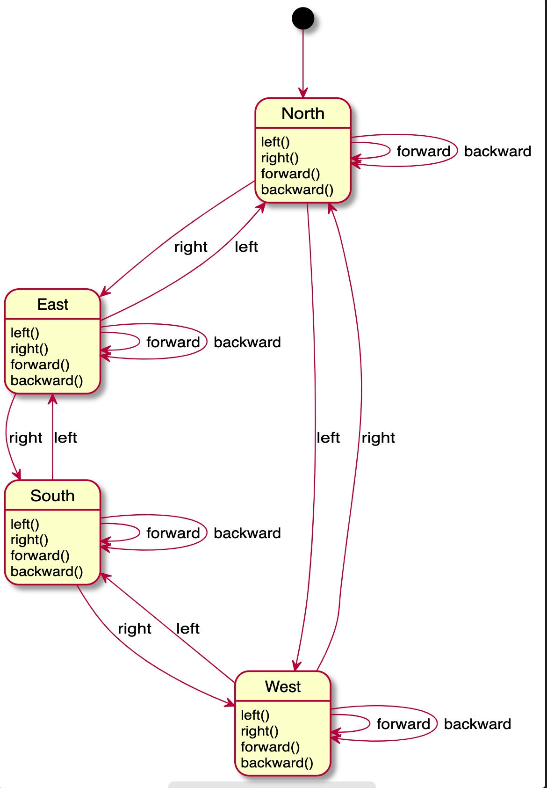
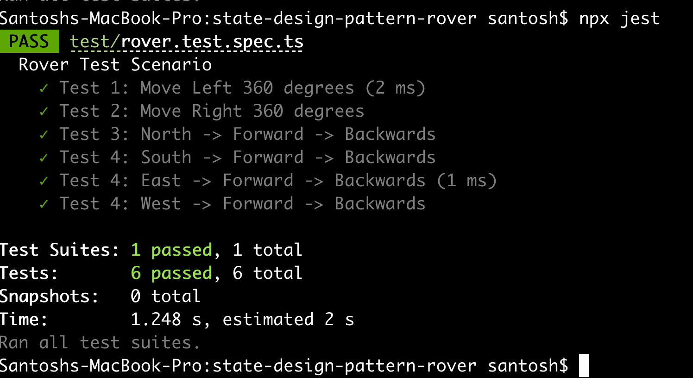

# Demo of State Design Pattern - TypeScript

## The Rover Coding Kata

You are given an initial startig point of a rover `(x,y)` and the direction it is facing.

Rover receives a character array of commands.

Implement the commands that move the rover `forward/ backward`

Implement the commands that turn the rover `right/ left`

## Applying State Design Pattern

- Create a Main class, name it as `Rover`
- Create an interface, name it as `Facing` with methods to turn and move the rover
- Create classes for each of the states.
  - `North`
  - `South`
  - `East`
  - `West`
- Each of the above classes will implement the interface `Facing`

- Rover will have a method to set its facing `setFacing(<new facing>)`

- Each state will have an instance of the `Rover` given to it when the state object is created, so that state of the rover can be changed dynamically by calling that method from within the state object.

- Write tests as along the way `TDD`

- Run the tests

  - `npm run test`

## Screencast of Running and Debugging Jest test

## State Transition Diagram

## Jest Test Run

